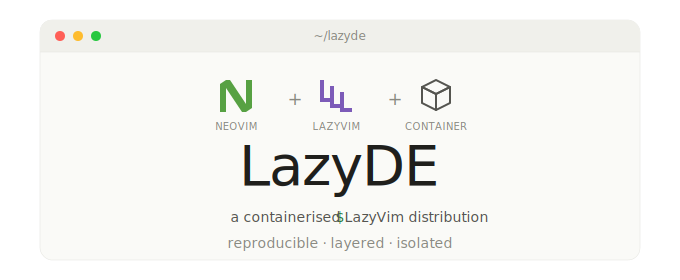

<p align="center">
  
</p>

# LazyDE

> A lean, layered container distribution of [LazyVim](https://www.lazyvim.org/) — Neovim as a development environment, in Docker.


---

## Why this exists

If you've ever tried to share a Neovim setup across machines — your laptop, a remote dev box, a colleague's workstation, a CI runner — you know the pain. Plugin managers download things on first launch. Mason needs a working compiler chain. Treesitter parsers compile per platform. The first 90 seconds of "I just want to edit a file" become "wait, why is `lua_ls` not installing?"

**LazyDE solves this by baking everything into a container.** You get a fully provisioned LazyVim environment that opens instantly — no first-run downloads, no Mason popups, no parser compilation surprises. Just `nvim` and you're editing.

It's also designed to be **layered**. The base image is intentionally minimal — it knows how to be Neovim, and that's it. Language-specific tooling (Python LSPs, .NET SDKs, PHP toolchains) lives in downstream images that build *on top* of this one, so you only carry what you actually use.

### Isolation as a security boundary

A modern Neovim setup pulls hundreds of plugins, language servers, and binaries from third parties — all running with your full user privileges and free to read your SSH keys, cloud credentials, and home directory. Running LazyVim inside a container draws a hard boundary around that risk: plugins only see what you explicitly mount in, typically just the current project. Every downstream image inherits the same isolation, and because each only carries what it needs, the supply-chain surface stays smaller too.

---

## Quick start

Clone this repo:

```bash
git clone git@github.com:d1stack/LazyDE.git
cd LazyDE
```

Build the base image, then run it in your current project:

```bash
docker build -t lazyde-base:stable .
docker run --rm -it -w /mnt/volume -v "$PWD:/mnt/volume" lazyde-base:stable
```

That's it. Neovim opens in `/mnt/volume` with all plugins, parsers, and Mason tools ready.

### Stock PHP / Python images

```bash
docker build -f web/php8.3-node22.dockerfile -t lazyde-web:php8.3-node22 .
docker run --rm -it -w /mnt/volume -v "$PWD:/mnt/volume" lazyde-web:php8.3-node22

docker build -f web/python3.12-node22.dockerfile -t lazyde-web:python3.12-node22 .
docker run --rm -it -w /mnt/volume -v "$PWD:/mnt/volume" lazyde-web:python3.12-node22
```

If `.config/nvim` is missing or only contains the placeholder, these images keep the baked-in starter config.

### Optional custom config

If you want to bake your own Neovim config into the PHP or Python image, copy it into `.config/nvim` and rebuild the same image from the repo root:

```bash
cp -r ~/.config/nvim .config/nvim

docker build -f web/php8.3-node22.dockerfile -t lazyde-web:php8.3-node22 .
docker run --rm -it -w /mnt/volume -v "$PWD:/mnt/volume" lazyde-web:php8.3-node22

docker build -f web/python3.12-node22.dockerfile -t lazyde-web:python3.12-node22 .
docker run --rm -it -w /mnt/volume -v "$PWD:/mnt/volume" lazyde-web:python3.12-node22
```

If `.config/nvim/init.lua` or `.config/nvim/lua/` exists, the build replaces the starter config with your own. If `.config/nvim/lazy-lock.json` exists, the build restores those exact plugin revisions. Otherwise it runs `Lazy! install`.

### Recommended shell aliases

```bash
alias nvim='docker run --rm -it -w /mnt/volume -v "$PWD:/mnt/volume" lazyde-base:stable'
alias nvim-php='docker run --rm -it -w /mnt/volume -v "$PWD:/mnt/volume" lazyde-web:php8.3-node22'
alias nvim-python='docker run --rm -it -w /mnt/volume -v "$PWD:/mnt/volume" lazyde-web:python3.12-node22'
```

If you prefer Podman, the same commands work with `podman build` and `podman run`.

---

## What's inside

The base image ships a deliberately minimal set of tools — enough to be a productive Neovim environment for editing config files, shell scripts, and documentation, plus the runtime hooks that downstream language images extend.

### Core

| Component         | Notes                                                     |
| ----------------- | --------------------------------------------------------- |
| Neovim (stable)   | Built from source, stripped, statically linked where possible |
| LazyVim starter   | Pre-cloned, plugins pre-installed via `Lazy! install`     |
| tree-sitter CLI   | Prebuilt binary from upstream releases                    |

### Runtime tools

| Tool         | Why it's here                                             |
| ------------ | --------------------------------------------------------- |
| `git`        | Required by `lazy.nvim` to manage plugins                 |
| `lazygit`    | LazyVim's built-in git UI                                 |
| `fd`         | File finder for Telescope (`fd-find` symlinked to `fd`)   |
| `ripgrep`    | Live grep backend for Telescope                           |
| `curl`       | Used by Mason and various plugins                         |
| `xclip`      | Clipboard integration                                     |
| `gcc` + `libc6-dev` | Needed by nvim-treesitter to compile parsers       |

### Pre-installed treesitter parsers

A small "always useful" set: `bash`, `diff`, `lua`, `luadoc`, `markdown`, `markdown_inline`, `vim`, `vimdoc`, `query`, `regex`. Language-specific parsers (Python, PHP, TypeScript, etc.) live in the downstream images.

### Pre-installed Mason tools

- `lua-language-server` — for editing your nvim config
- `stylua` — Lua formatter
- `shfmt` — shell script formatter

---

## Build & customization

The Dockerfile exposes a few build args you can override:

| Arg                    | Default     | Purpose                                  |
| ---------------------- | ----------- | ---------------------------------------- |
| `NVIM_VERSION`         | `stable`    | Neovim git ref to build (tag/branch/sha) |
| `TREE_SITTER_VERSION`  | `v0.26.8`   | tree-sitter CLI release tag              |

### Examples

Pin to a specific Neovim release:

```bash
docker build --build-arg NVIM_VERSION=v0.10.2 -t lazyde-base:v0.10.2 .
# or: podman build --build-arg NVIM_VERSION=v0.10.2 -t lazyde-base:v0.10.2 .
```

Track Neovim nightly:

```bash
docker build --build-arg NVIM_VERSION=nightly -t lazyde-base:nightly .
# or: podman build --build-arg NVIM_VERSION=nightly -t lazyde-base:nightly .
```

Tag both `stable` and `latest` at once:

```bash
docker build -t lazyde-base:stable -t lazyde-base:latest .
# or: podman build -t lazyde-base:stable -t lazyde-base:latest .
```

### Verifying the build

```bash
docker run --rm lazyde-base:stable nvim --version
docker run --rm lazyde-base:stable sh -c 'which fd lazygit rg tree-sitter git'
# or: podman run --rm lazyde-base:stable nvim --version
# or: podman run --rm lazyde-base:stable sh -c 'which fd lazygit rg tree-sitter git'
```

---

## Layering your own LazyVim config
 
The base image ships LazyVim's starter config. To use your own configuration with the web images, copy it into `.config/nvim` and build the regular web image from the repo root.

```bash
cp -r ~/.config/nvim .config/nvim
docker build -f web/php8.3-node22.dockerfile -t lazyde-web:php8.3-node22 .
docker build -f web/python3.12-node22.dockerfile -t lazyde-web:python3.12-node22 .
```

Behavior:

- If `.config/nvim/init.lua` or `.config/nvim/lua/` exists, the web image replaces the starter config with your own.
- If `.config/nvim/lazy-lock.json` exists, the build runs `Lazy! restore` to keep the exact plugin revisions from your lockfile.
- If no lockfile is present, the build runs `Lazy! install` to install the plugins declared by your config.
- If `.config/nvim` is missing or only contains the placeholder, the build keeps the stock config already baked into the image.
- The PHP and Python parent images keep their existing baked-in treesitter parsers and Mason tools; extra tools are not inferred from your custom config.
 
---

## Web development image (`lazyde-web`)

Full-stack web image variants — PHP or Python + Node, TypeScript, Vue, HTML, CSS — built on top of `lazyde-base`.

### What's included

For PHP variants:
- **PHP** with `mbstring`, `xml`, `curl`, `zip`, `mysql`, `pgsql`, `sqlite3`, `intl`, `bcmath`, `gd`, `opcache` extensions
- **Composer 2.8** for PHP dependency management
- **Node** + **npm** from the official Docker image
- **TypeScript** (`tsc`) globally installed
- **Vue language server** + **TypeScript plugin** for Vue 3
- **vscode-langservers-extracted** providing HTML, CSS, JSON, and ESLint LSPs
- **Treesitter parsers**: `php`, `phpdoc`, `html`, `css`, `scss`, `javascript`, `typescript`, `tsx`, `vue`, `json`, `jsonc`, `yaml`
- **Mason tools**: `phpactor`, `php-cs-fixer`, `phpcs`, `vtsls`, `prettier`, `eslint-lsp`, `json-lsp`

For Python variants:
- **Python** (`3.11`, `3.12`, `3.13`) from official python images
- **uv**, **ruff**, **pyright**
- **Django**, **Flask**, **FastAPI** CLIs preinstalled
- **Node** + **npm**
- **TypeScript** (`tsc`) globally installed
- **Vue language server** + **TypeScript plugin** for Vue 3
- **vscode-langservers-extracted** providing HTML, CSS, JSON, and ESLint LSPs
- **Treesitter parsers**: `python`, `toml`, `yaml`, `html`, `css`, `scss`, `javascript`, `typescript`, `tsx`, `vue`, `json`, `jsonc`
- **Mason tools**: `pyright`, `ruff`, `vtsls`, `prettier`, `eslint-lsp`, `json-lsp`

### Available variants

Different projects need different versions, so each combination has its own dedicated Dockerfile under [`web/`](web/).

| Dockerfile                      | PHP | Node     | Notes                          |
| ------------------------------- | --- | -------- | ------------------------------ |
| `php8.3-node22.dockerfile`      | 8.3 | 22 (LTS) | **Recommended default**        |
| `php8.3-node20.dockerfile`      | 8.3 | 20 (LTS) | Older Node LTS                 |
| `php8.3-node24.dockerfile`      | 8.3 | 24       | Active release (LTS Oct 2026)  |
| `php8.2-node20.dockerfile`      | 8.2 | 20 (LTS) | Legacy Laravel/Symfony         |
| `php8.2-node22.dockerfile`      | 8.2 | 22 (LTS) |                                |
| `php8.4-node22.dockerfile`      | 8.4 | 22 (LTS) | Latest stable PHP              |
| `php8.4-node24.dockerfile`      | 8.4 | 24       | Cutting edge                   |

| Dockerfile                        | Python | Node     | Notes                          |
| --------------------------------- | ------ | -------- | ------------------------------ |
| `python3.12-node22.dockerfile`    | 3.12   | 22 (LTS) | **Recommended Python default** |
| `python3.11-node22.dockerfile`    | 3.11   | 22 (LTS) | Broad compatibility            |
| `python3.13-node22.dockerfile`    | 3.13   | 22 (LTS) | Newest stable Python           |
| `python3.11-node24.dockerfile`    | 3.11   | 24       | Newer Node toolchain           |
| `python3.12-node24.dockerfile`    | 3.12   | 24       |                                |
| `python3.13-node24.dockerfile`    | 3.13   | 24       | Most current Python + Node     |

Each variant produces its own tag: `lazyde-web:<variant>`.

### Building

```bash
docker build -f web/php8.3-node22.dockerfile -t lazyde-web:php8.3-node22 .
```

```bash
docker build -f web/python3.12-node22.dockerfile -t lazyde-web:python3.12-node22 .
```

### Running

```bash
docker run --rm -it -w /mnt/volume -v "$PWD:/mnt/volume" lazyde-web:php8.3-node22
```

```bash
docker run --rm -it -w /mnt/volume -v "$PWD:/mnt/volume" lazyde-web:python3.12-node22
```


## Roadmap

The base image is the foundation. Language-specific flavors stack on top — each adds its own treesitter parsers, Mason tools, and runtime SDKs.

| Image              | Status     | What it adds                                              |
| ------------------ | ---------- | --------------------------------------------------------- |
| `lazyde-base`      | ✅ Released | Neovim + LazyVim + core tooling                           |
| `lazyde-web`       | ✅ Released | PHP, Node, TypeScript, Vue, HTML/CSS — multiple variants  |
| `lazyde-python`    | ✅ Released | Python variants under `web/` with `uv`, `pyright`, `ruff`, Django/FastAPI/Flask |
| `lazyde-dotnet`    | 🚧 Planned | .NET SDK, `omnisharp`, `csharpier`, `netcoredbg`          |
| `lazyde-systems`   | 💭 Idea    | C/C++/Rust toolchains, `clangd`, `cmake-language-server`  |
| `lazyde-full`      | 💭 Idea    | Everything, for when you don't want to choose             |

Each downstream image will follow the same conventions: pre-installed parsers, pre-installed Mason tools, no first-launch downloads.

---

## Project structure

```
lazyde/
├── Dockerfile                       # The base image build
├── README.md                        # You're reading it
├── banner.svg                       # Project banner
├── web/                             # PHP/Python + JS/TS development variants
│   ├── README.md
│   ├── php8.2-node20.dockerfile
│   ├── php8.2-node22.dockerfile
│   ├── php8.3-node20.dockerfile
│   ├── php8.3-node22.dockerfile     # default variant
│   ├── php8.3-node24.dockerfile
│   ├── php8.4-node22.dockerfile
│   ├── php8.4-node24.dockerfile
│   ├── python3.11-node22.dockerfile
│   ├── python3.11-node24.dockerfile
│   ├── python3.12-node22.dockerfile
│   ├── python3.12-node24.dockerfile
│   ├── python3.13-node22.dockerfile
│   └── python3.13-node24.dockerfile
└── (future)
    ├── python/
    ├── dotnet/
    └── systems/
```

---

## Design principles

A few rules this project tries to follow:

1. **Reproducible builds.** Every external download is version-pinned. No "latest from main" surprises.
2. **No first-run work.** If a tool is meant to be available, it's installed at build time — never lazily on first launch.
3. **Layered, not monolithic.** The base stays minimal; language tooling is opt-in via downstream images.
4. **Multi-stage where it matters.** Build dependencies (cmake, ninja, gettext) stay in the builder stage and never bloat the final image.

---

## Contributing

Contributions are welcome. The project is in early days, so the easiest ways to help right now:

- File issues for things that don't work or could be cleaner
- Propose a downstream language image (or build one and PR it)
- Improve build times or shrink final image sizes

---

## License

Apache v2 — see [LICENSE](LICENSE.txt).

LazyVim, Neovim, and all bundled tools retain their respective licenses.
